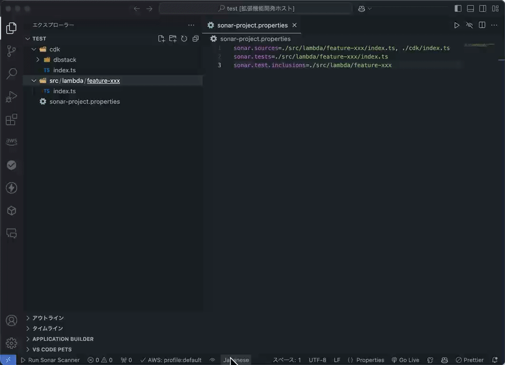

# easy-sonar-prop-setting README

`sonar-project.properties` を簡単に設定できるツールです。

## 機能

- SonarQube チェック対象のパスを右クリックメニューで追加可能

- `sonar-scanner` コマンドをワンクリックで実行可能

## 必要条件

特になし

## 拡張機能の設定

以下の設定を調整できます：

* `easySonarPropSetting.propertiesFileName`: プロパティファイルの名前を設定
* `easySonarPropSetting.sonarSourcesKey`: SonarQube のソースパスのキーを設定
* `easySonarPropSetting.sonarTestsKey`: SonarQube のテストパスのキーを設定
* `easySonarPropSetting.sonarTestInclusionsKey`: SonarQube のテストインクルージョンパスのキーを設定
* `easySonarPropSetting.sonarExclusionsKey`: SonarQube の除外パスのキーを設定
* `easySonarPropSetting.enableAddSonarSources`: SonarQube のソースパス追加機能を有効/無効に設定
* `easySonarPropSetting.enableClearAndAddSonarSources`: SonarQube のソースパスクリア＆追加機能を有効/無効に設定
* `easySonarPropSetting.enableAddSonarTests`: SonarQube のテストパス追加機能を有効/無効に設定
* `easySonarPropSetting.enableClearAndAddSonarTests`: SonarQube のテストパスクリア＆追加機能を有効/無効に設定
* `easySonarPropSetting.enableAddSonarTestInclusions`: SonarQube のテストインクルージョンパス追加機能を有効/無効に設定
* `easySonarPropSetting.enableClearAndAddSonarTestInclusions`: SonarQube のテストインクルージョンパスクリア＆追加機能を有効/無効に設定
* `easySonarPropSetting.enableAddSonarExclusions`: SonarQube の除外パス追加機能を有効/無効に設定
* `easySonarPropSetting.enableClearAndAddSonarExclusions`: SonarQube の除外パスクリア＆追加機能を有効/無効に設定
* `easySonarPropSetting.showRunSonarScannerButton`: ステータスバーに `Run Sonar Scanner` ボタンを表示/非表示に設定
* `easySonarPropSetting.runSonarScannerButtonText`: ステータスバーの `Run Sonar Scanner` ボタンのテキストを設定

---

**Enjoy!**